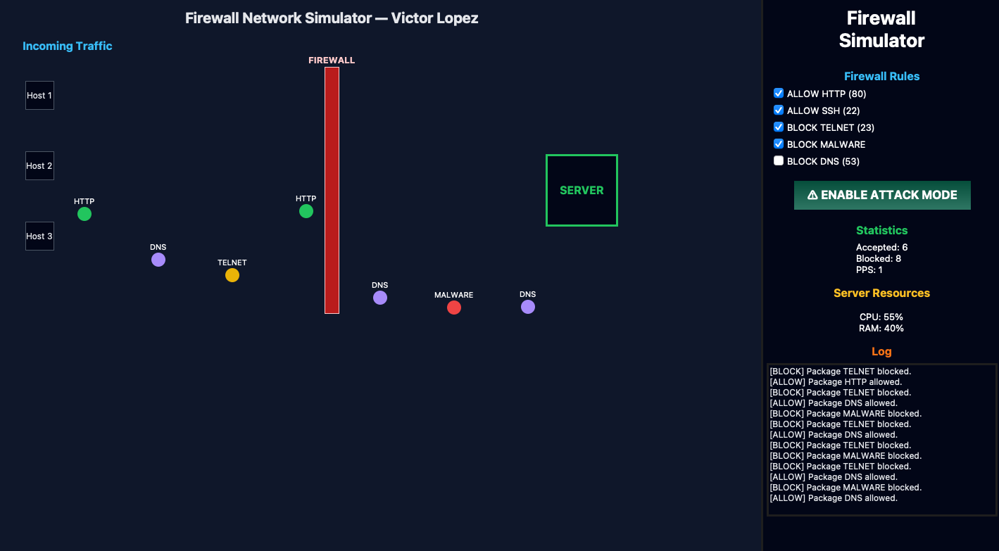

# 🔥 Firewall Network Simulator 

This project was completed to fulfill the requirements of the "Code In Place 2026" course, applying everything learned.

The simulator visually demonstrates how a firewall processes network traffic, allowing or blocking packets based on configurable rules. It includes animations, real‑time statistics, an attack mode, and a modern interface built with Tkinter.

---

## 🚀 Features

- **Interactive visual interface** built with Tkinter  
- **Animated packets** traveling from hosts to a secure server  
- **Configurable firewall rules** (HTTP, SSH, Telnet, Malware, DNS)  
- **Attack Mode** with:
  - Rapid hostile packet waves  
  - Flashing alert button  
  - Warning banner  
  - Firewall in defensive mode  
- **Real‑time statistics**:
  - Allowed packets  
  - Blocked packets  
  - PPS (Packets Per Second)  
- **Simulated CPU and RAM usage**  
- **Dynamic log system** with line limit and event types  

---

## 🖼️ Preview

Add a screenshot of the simulator here:

```markdown


